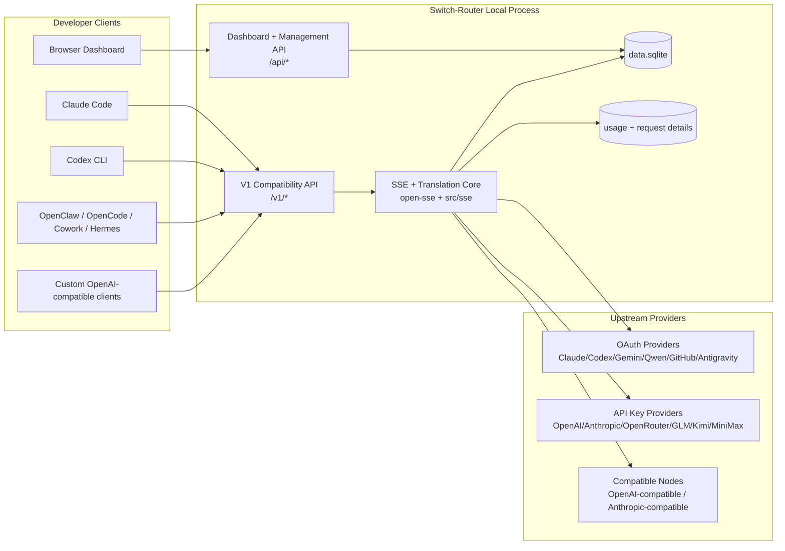
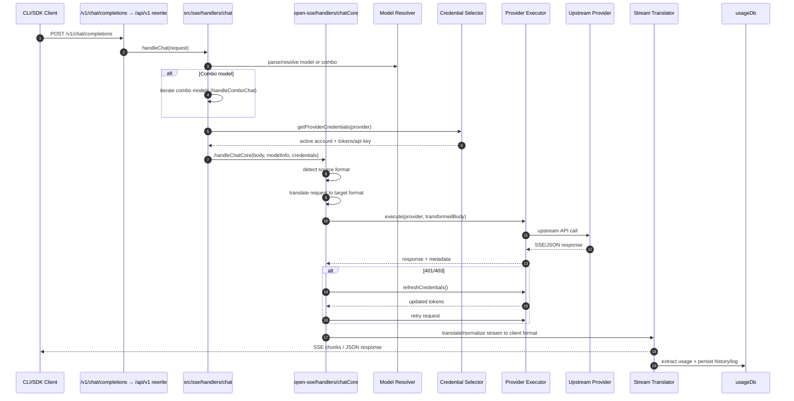
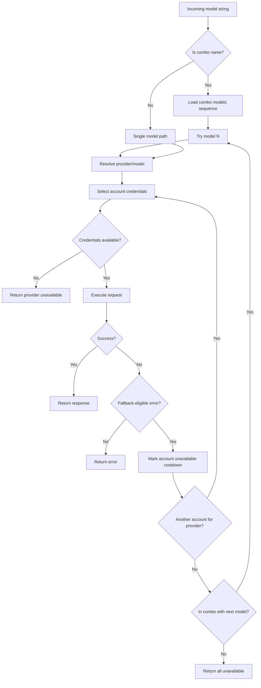
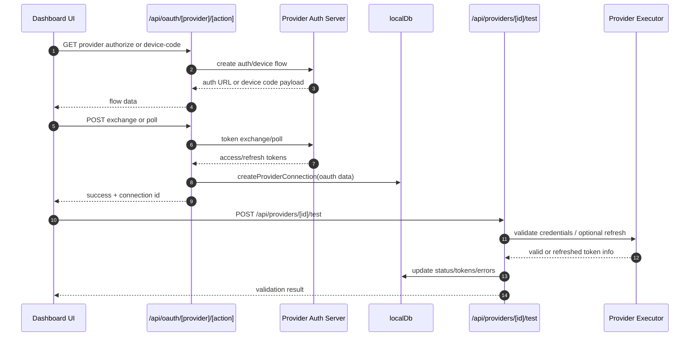
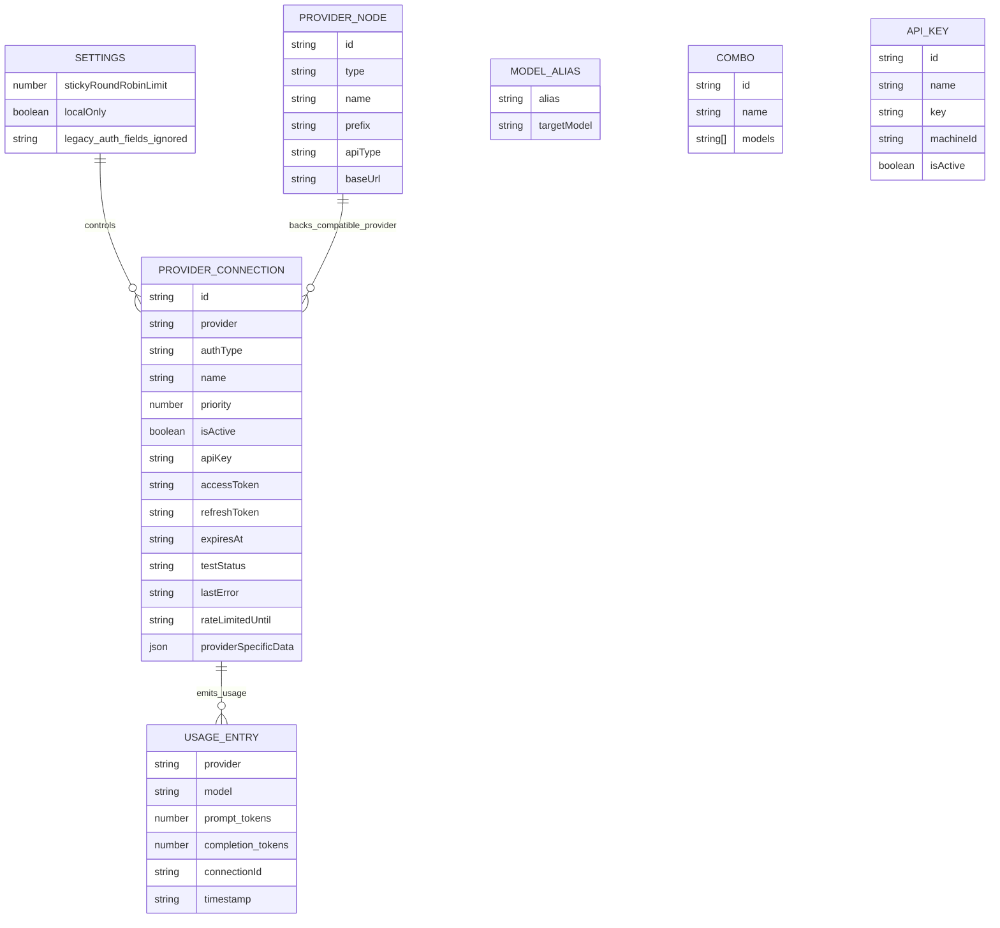
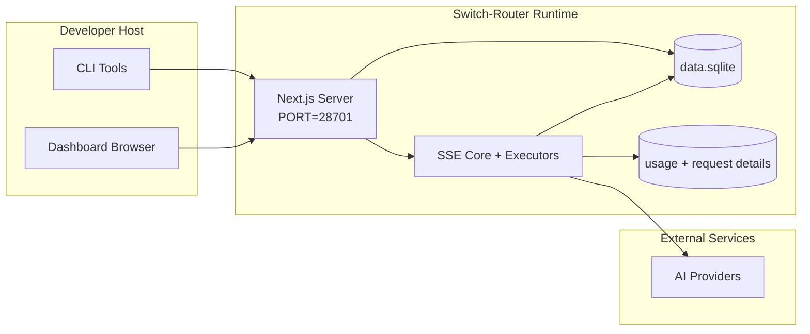

# Switch-Router Architecture (local-first)

_Last updated: 2026-08-01_

## Executive Summary

Switch-Router is a local AI routing gateway and dashboard optimized for single-user use. It retains compatible provider and translation modules from the upstream codebase without exposing an old remote product surface.
It provides a single OpenAI-compatible endpoint (`/v1/*`) and routes traffic across multiple upstream providers with translation, fallback, token refresh, and usage tracking.

Core capabilities:

- OpenAI-compatible API surface for CLI/tools
- Request/response translation across provider formats
- Model combo fallback (multi-model sequence)
- Account-level fallback (multi-account per provider)
- OAuth + API-key provider connection management
- Local persistence for providers, keys, aliases, combos, settings, pricing
- Usage/cost tracking and request logging

Primary runtime model:

- Next.js app routes under `src/app/api/*` implement both dashboard APIs and compatibility APIs
- A shared SSE/routing core in `src/sse/*` + `open-sse/*` handles provider execution, translation, streaming, fallback, and usage

## Scope and Boundaries

### In Scope

- Local gateway runtime
- Dashboard management APIs
- Provider authentication and token refresh
- Request translation and SSE streaming
- Local state + usage persistence

### Out of Scope

- Provider SLA/control plane outside local process
- External CLI binaries themselves (Claude CLI, Codex CLI, etc.)

## High-Level System Context

## Core Runtime Components

## 1) API and Routing Layer (Next.js App Routes)

Main directories:

- `src/app/api/v1/*` for the compatibility APIs (the `/v1beta` route dir was removed in 0.10.0)
- `src/app/api/*` for management/configuration APIs
- Next rewrites in `next.config.mjs` map `/v1/*` to `/api/v1/*`
- Since 0.10.0 the PUBLIC gateway surface is `/v1` only (the `/codex`,
  `/responses` and `/v1beta` client surfaces were removed — rewrites deleted
  from `next.config.mjs`, `src/app/api/v1beta/` removed). Codex CLI talks
  Responses API through `<origin>/v1/responses`; Gemini-native clients must
  use `/v1`. Direct `/api/v1*` calls stay local-only (403 from remote) per `dashboardGuard.js`

Important compatibility routes (local-only from outside, reached via `/v1/*` rewrites):

- `src/app/api/v1/chat/completions/route.js`
- `src/app/api/v1/messages/route.js`
- `src/app/api/v1/responses/route.js`
- `src/app/api/v1/models/route.js`
- `src/app/api/v1/messages/count_tokens/route.js`

Management domains:

- Local-only/settings: `src/dashboardGuard.js`, `src/app/api/auth/status`, `src/app/api/settings/*`
- Providers/connections: `src/app/api/providers*`
- Provider nodes: `src/app/api/provider-nodes*`
- OAuth: `src/app/api/oauth/*`
- Keys/aliases/combos/pricing: `src/app/api/keys*`, `src/app/api/models/alias`, `src/app/api/combos*`, `src/app/api/pricing`
- Usage: `src/app/api/usage/*`
- Local configuration and persistence: `src/lib/db/*`, `src/lib/dataDir.js`, `src/lib/usageDb.js`
- CLI tooling helpers: `src/app/api/cli-tools/*`

## 2) Routing, SSE + Translation Core

Main flow modules:

- Entry: `src/sse/handlers/chat.js`
- Account fallback orchestration: `src/core/routing/routingEngine.js`
- Provider boundary: `src/core/providers/providerAdapter.js`
- Credential projection/redaction: `src/core/credentials/credentialProjection.js`
- Core orchestration: `open-sse/handlers/chatCore.js`
- Provider execution adapters: `open-sse/executors/*`
- Format detection/provider config: `open-sse/services/provider.js`
- Model parse/resolve: `src/sse/services/model.js`, `open-sse/services/model.js`
- Account fallback logic: `open-sse/services/accountFallback.js`
- Translation registry: `open-sse/translator/index.js`
- Stream transformations: `open-sse/utils/stream.js`, `open-sse/utils/streamHandler.js`
- Usage extraction/normalization: `open-sse/utils/usageTracking.js`

## 3) Persistence Layer

Primary state DB:

- `src/lib/db/index.js` (with compatibility exports from `src/lib/localDb.js`)
- driver: `src/lib/db/driver.js` (`better-sqlite3`, then `node:sqlite`, then `sql.js`)
- file: `${DATA_DIR}/db/data.sqlite` (or the platform default legacy data directory when `DATA_DIR` is unset)
- entities: providerConnections, providerNodes, modelAliases, combos, apiKeys, settings, pricing

Usage DB:

- `src/lib/db/repos/usageRepo.js` (compatibility exports from `src/lib/usageDb.js`)
- usage and request-detail data share the SQLite database under `DATA_DIR`

## 4) Auth + Security Surfaces

- Local-only dashboard boundary: `src/dashboardGuard.js`; legacy cookie-auth endpoints remain under `src/app/api/auth/*` for compatibility but are not required on loopback
- API key generation/verification: `src/shared/utils/apiKey.js`
- Provider secrets persisted in `providerConnections` entries
- Optional proxy support for upstream calls via env proxy variables (`open-sse/utils/proxyFetch.js`)

## 5) Local-only boundary

- Dashboard, API keys, provider credentials, combos and usage data stay on the local machine.
- Tunnel, public relay, cloud-sync and remote deployment controls are removed from the runtime.
- The server binds to `127.0.0.1` unconditionally (`custom-server.js` overrides `HOSTNAME`); external hosting is not supported. A local reverse proxy still works because it connects from loopback.
- The `/v1/realtime` WebSocket relay is handled in `custom-server.js` outside the Next middleware, so it enforces loopback itself: it rejects a non-loopback TCP peer and a non-loopback browser `Origin` before resolving provider credentials.
- HTTP proxy pools remain only as outbound egress proxies for calls from Switch-Router to upstream providers.

## Request Lifecycle (`/v1/chat/completions`)

## Combo + Account Fallback Flow

Fallback decisions are driven by `open-sse/services/accountFallback.js` using status codes and error-message heuristics.

## Provider OAuth Onboarding and Token Refresh Lifecycle

Refresh during live traffic is executed inside `open-sse/handlers/chatCore.js` via executor `refreshCredentials()`.

## Data Model and Storage Map

Physical storage files:

- main state, usage, request details: `${DATA_DIR}/db/data.sqlite`
- database backups: `${DATA_DIR}/db/backups/...`
- optional translator/request debug sessions: `<repo>/logs/...`

## Deployment Topology

## Module Mapping (Decision-Critical)

### Route and API Modules

- `src/app/api/v1/*`: compatibility APIs
- `src/app/api/providers*`: provider CRUD, validation, testing
- `src/app/api/provider-nodes*`: custom compatible node management
- `src/app/api/oauth/*`: OAuth/device-code flows
- `src/app/api/keys*`: local API key lifecycle
- `src/app/api/models/alias`: alias management
- `src/app/api/combos*`: fallback combo management
- `src/app/api/pricing`: pricing overrides for cost calculation
- `src/app/api/usage/*`: usage and logs APIs
- `src/app/api/cli-tools/*`: local CLI config writers/checkers

### Routing and Execution Core

- `src/sse/handlers/chat.js`: request parse, combo handling and account selection loop
- `src/core/routing/routingEngine.js`: bounded account-level fallback attempts
- `src/core/providers/providerAdapter.js`: stable provider executor boundary
- `src/core/credentials/credentialProjection.js`: runtime credential projection and API redaction
- `open-sse/handlers/chatCore.js`: translation, adapter dispatch, retry/refresh handling, stream setup
- `open-sse/executors/*`: provider-specific network and format behavior

### Translation Registry and Format Converters

- `open-sse/translator/index.js`: translator registry and orchestration
- Request translators: `open-sse/translator/request/*`
- Response translators: `open-sse/translator/response/*`
- Format constants: `open-sse/translator/formats.js`

### Persistence

- `src/lib/localDb.js`: persistent config/state
- `src/lib/usageDb.js`: usage history and rolling request logs

## Provider Executor Coverage

Specialized executors:

- `antigravity`
- `gemini-cli`
- `github`
- `codex`

Default executor path:

- all other providers (including compatible node providers) use `open-sse/executors/default.js`

## Format Translation Coverage

Detected source formats include:

- `openai`
- `openai-responses`
- `claude`
- `gemini`

Target formats include:

- OpenAI chat/Responses
- Claude
- Gemini/Gemini-CLI/Antigravity envelope

Translations are selected dynamically based on source payload shape and provider target format.

## Failure Modes and Resilience

## 1) Account/Provider Availability

- provider account cooldown on transient/rate/auth errors
- account fallback before failing request
- combo model fallback when current model/provider path is exhausted

## 2) Token Expiry

- pre-check and refresh with retry for refreshable providers
- 401/403 retry after refresh attempt in core path

## 3) Stream Safety

- disconnect-aware stream controller
- translation stream with end-of-stream flush and `[DONE]` handling
- usage estimation fallback when provider usage metadata is missing

## 4) Local-only degradation

- upstream provider failures are handled by account fallback and retry policy
- loss of an optional outbound proxy does not expose a public endpoint; the request fails locally or retries the next account or combo model

## 5) Data Integrity

- DB shape migration/repair for missing keys
- corrupt JSON reset safeguards for localDb and usageDb

## Observability and Operational Signals

Runtime visibility sources:

- console logs from `src/sse/utils/logger.js`
- per-request usage aggregates from `usageRepo.js`
- recent request status entries from the SQLite usage history
- optional deep request/translation logs under `logs/` when `ENABLE_REQUEST_LOGS=true`
- dashboard usage endpoints (`/api/usage/*`) for UI consumption

## Security-Sensitive Boundaries

- JWT secret (`JWT_SECRET`) secures dashboard session cookie verification/signing
- Initial password fallback (`INITIAL_PASSWORD`, default `123456`) must be overridden in real deployments
- API key HMAC secret (`API_KEY_SECRET`) secures generated local API key format
- Provider secrets (API keys/tokens) are persisted in local DB and should be protected at filesystem level
- Provider selection settings contain no credentials; `redactProviderConnection()` removes API keys/tokens before dashboard responses
- Loopback dashboard requests do not require login; non-loopback dashboard requests are rejected by `src/dashboardGuard.js`

## Environment and Runtime Matrix

Environment variables actively used by code:

- App/auth: `JWT_SECRET`, `INITIAL_PASSWORD`
- Storage: `DATA_DIR`
- Security hashing: `API_KEY_SECRET`, `MACHINE_ID_SALT`
- Logging: `ENABLE_REQUEST_LOGS`
- Local OIDC callback base URL: `BASE_URL`, `NEXT_PUBLIC_BASE_URL`
- Outbound proxy: `HTTP_PROXY`, `HTTPS_PROXY`, `ALL_PROXY`, `NO_PROXY` and lowercase variants
- Platform/runtime helpers (not app-specific config): `APPDATA`, `NODE_ENV`, `PORT`. `HOSTNAME` is read by the standalone server but overridden to `127.0.0.1` by `custom-server.js` (local-first; external binding removed).

## Known Architectural Notes

1. Existing `~/.9router` data is reused for compatibility when no Switch-Router data directory exists; new installs use the Switch-Router data directory or explicit `DATA_DIR`.
2. `/api/v1/route.js` returns a static model list and is not the main models source used by `/v1/models`.
3. Request logger writes full headers/body when enabled; treat log directory as sensitive.
4. The local-only boundary is intentional: provider APIs are remote upstream dependencies, but Switch-Router itself does not expose a public access layer.

## Operational Verification Checklist

- Build from source: `npm run build`
- Start service and verify:
- `npm run build && npm start`
- `GET /api/settings`
- `GET /api/v1/models`
- Local tool target base URL should be `http://127.0.0.1:28701/v1`
- Configure Combos from `/dashboard/combos` and verify model discovery through `/v1/models`
